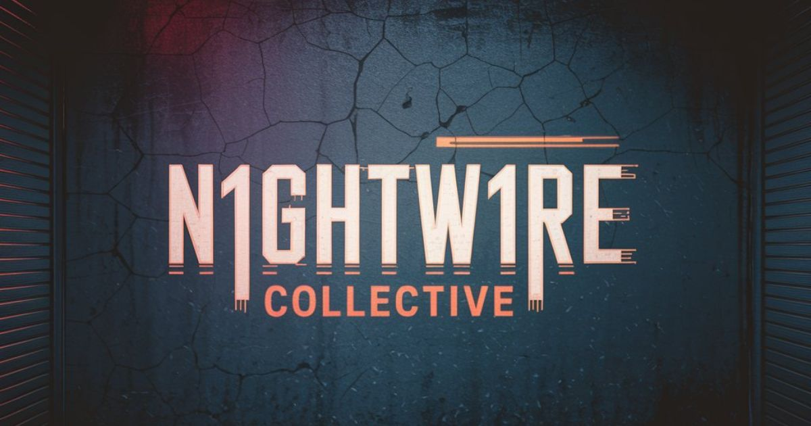
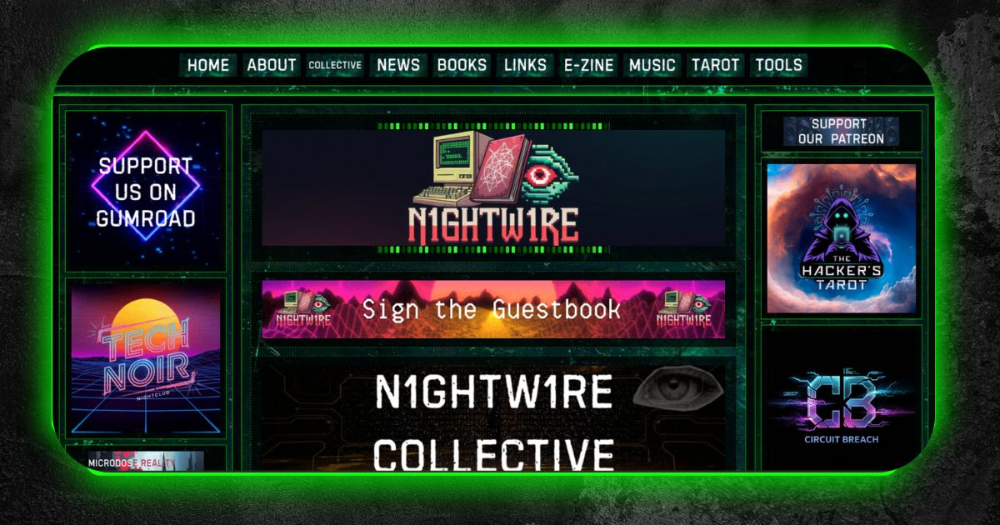

# N1ghtw1re Collective

## Welcome to the Digital Resistance

> "Signal in the static. Truth in transmission. Tools for the new undernet."

---

## Table of Contents
- [Features](#features)
- [Getting Started](#getting-started)
- [Philosophy & Inspiration](#philosophy--inspiration)
- [Screenshots/Previews](#screenshotspreviews)
- [Credits](#credits)
- [License](#license)
- [Contact & Community](#contact--community)
- [Easter Eggs & Fun](#easter-eggs--fun)

---

## Features
- **Collective Hub**: The hub of a world of projects—explore, connect, and contribute to a growing network of digital resistance.
- **Articles**: Deep dives on privacy, digital rights, activism, and tech dystopia.
- **E-Zine**: Monthly, free, and packed with cyberpunk/tech culture.
- **Tools**: Privacy utilities, web building helpers, markdown converters, and more.
- **Books & Resources**: Manifestos, guides, and the Hacker’s Tarot.
- **Music**: Soundtracks for the resistance—curated playlists and original tracks.
- **Links**: Curated open-source, privacy, and creative resources.

---

## Getting Started

### 1. View the Site Locally

- Clone or download this repository to your computer.
- Open `index.html` in your web browser. No build step required—this is a classic static site!

### 2. Folder Structure Overview

- `index.html` — Home page
- `articles/` — Articles and essays (organized by date)
- `assets/` — Images, banners, cursors, and other media
- `books/` — Digital books and long-form resources
- `css/` — Stylesheets
- `ezine/` — Monthly e-zine issues
- `pages/` — About, tools, music, links, and more
- `partials/` — Shared HTML components (nav, footer, sidebars)
- `tools/` — Standalone web tools

### 3. How to Contribute

- Fork this repo and make your changes.
- Submit a pull request with a clear description of your edits or additions.
- For new articles, add your HTML file to the appropriate `articles/` subfolder.
- For new tools, add your HTML/JS/CSS to the `tools/` directory.
- Please keep the cyberpunk, privacy-first, and creative spirit alive!

## Philosophy & Inspiration
- Why this site exists
- Core values: privacy, autonomy, digital freedom, creative rebellion

## Screenshots/Previews

## Credits
- Who built it, contributors, special thanks

## License

This project is licensed under the MIT License. See the [LICENSE](css/LICENSE) file for details.

## Contact & Community
- How to get in touch (email, Mastodon, etc.)
- How to join/support (Patreon, etc.)

## Easter Eggs & Fun
- Hidden features, retro touches, or “secrets” for explorers

---

> "Plug in. Break free. The future is unwritten."
